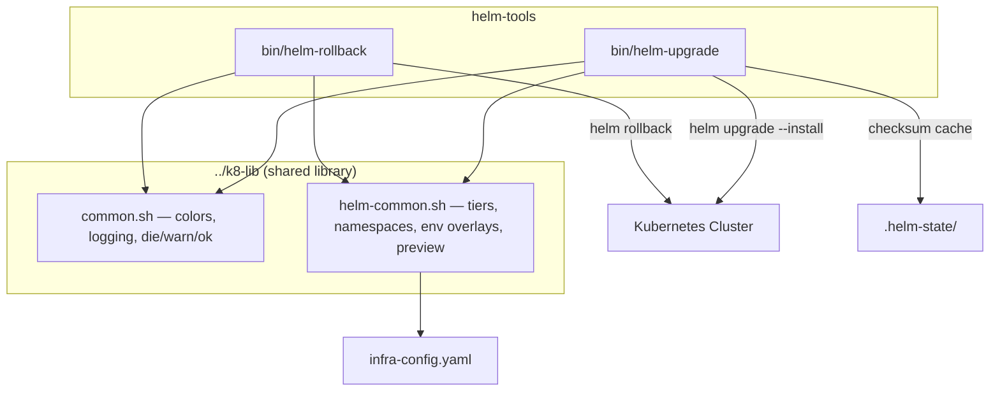

# helm-tools Architecture

## Overview

CLI utilities for managing Helm chart lifecycle across a tiered Kubernetes infrastructure. Provides dependency-ordered upgrades with change detection and dependency-aware rollbacks with revision selection. Deployed as standalone shell scripts installed to `~/.local/bin`.

## System Diagram



## Core Components

| Component | Purpose |
|-----------|---------|
| `bin/helm-upgrade` | Tier-ordered `helm upgrade --install` with MD5 change detection, env overlays, interactive selection, manifest preview, and conflict auto-fix |
| `bin/helm-rollback` | Reverse-tier rollback with three modes: explicit chart selection, auto-detect unhealthy pods, and time-window (`--back-to`) |
| `../k8-lib/common.sh` | Shared shell library: color codes, `step`/`info`/`warn`/`ok`/`fail`/`die` logging, `_in_list` helper |
| `../k8-lib/helm-common.sh` | Tier definitions, namespace lookup, env overlay resolution, release naming, timeout config, manifest diff/preview |
| `.helm-state/` | Persisted MD5 checksums keyed by release name; used by `helm-upgrade` to skip unchanged charts |

## Data Flow

### helm-upgrade

1. Discover charts from `helm/*/Chart.yaml`
2. Apply filters: namespace, env overlay, include/exclude lists
3. Optionally present interactive toggle UI
4. Compute MD5 checksums; skip unchanged charts (unless `--force`)
5. Analyze manifest-level impacts per chart
6. Display plan table; confirm with user
7. Execute tier-by-tier (tier 0 first); halt on tier failure
8. On conflict errors, attempt field-ownership transfer and retry
9. Persist checksums for successful upgrades

### helm-rollback

1. **Mode dispatch**: `--include` (explicit), `--back-to` (time-window), or auto-detect (unhealthy pods + recent deploys)
2. Build rollback plan with target revisions
3. Confirm or enter interactive plan editor (`edit <chart>`, `rm <chart>`)
4. Execute in reverse tier order (highest tier first)

## Key Design Decisions

- **MD5 change detection**: Avoids unnecessary Helm releases; checksums are per-release so staging and production track independently
- **Tier-ordered execution**: Guarantees infrastructure (tier 0) deploys before workloads (tier 4+); rollback reverses this order
- **Shared k8-lib**: Common shell functions live in a sibling submodule to avoid duplication across devops tools
- **No external dependencies beyond Helm/kubectl/jq**: Portable across any system with a standard shell

## Technology Stack

| Layer | Tool |
|-------|------|
| Language | Bash (set -euo pipefail) |
| Orchestration | Helm 3.8+ (OCI-capable) |
| Cluster | kubectl |
| Data | jq for JSON parsing |
| Diff | Configurable: VS Code, kdiff3, opendiff, meld, terminal |

## Project Layout

```
helm-tools/
  bin/
    helm-upgrade        # Dependency-ordered upgrade with change detection
    helm-rollback       # Dependency-aware rollback with revision selection
  docs/
    PROJ-ARCH.md        # This file
    PROJ-ARCH.summary.md
  Makefile              # install target copies bin/* to ~/.local/bin
```
