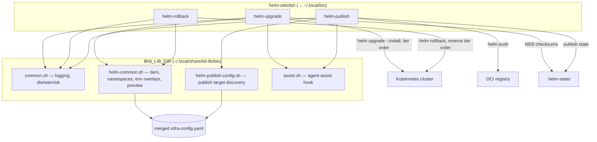

# helm-utils Architecture

## Overview

Terminal utility package providing the Helm chart lifecycle tooling for the Noizu k8s platform: dependency-ordered (tiered) upgrades with MD5 change detection (`helm-upgrade`), dependency-aware reverse-tier rollbacks (`helm-rollback`), and OCI chart packaging/publishing (`helm-publish`). Each tool is a standalone Bash script (`set -euo pipefail`) installed to `~/.local/bin` via `make install` (or repo-root `make install-utilities`, which also installs the shared k8-lib).

All three scripts source the shared shell library from `$K8_LIB_DIR` (default `~/.local/share/k8-lib`) rather than a relative sibling path, so they work from any working directory. Runtime configuration comes from the merged `infra-config.yaml` resolved relative to `$INFRA_ROOT` (default `$PWD`), overridable with `--config <file>` — the scripts pre-parse `--config` before sourcing k8-lib so the config path is honored during library initialization.

## System Diagram

```mermaid
graph TB
    subgraph helm-utils ["helm-utils/bin (→ ~/.local/bin)"]
        HU[helm-upgrade]
        HR[helm-rollback]
        HP[helm-publish]
    end

    subgraph k8lib ["$K8_LIB_DIR (~/.local/share/k8-lib/bin)"]
        COM[common.sh — logging, die/warn/ok]
        HC[helm-common.sh — tiers, namespaces, env overlays, preview]
        HPC[helm-publish-config.sh — publish target discovery]
        AS[assist.sh — agent-assist hook]
    end

    HU --> COM & HC & AS
    HR --> COM & HC
    HP --> COM & HPC & AS

    HC --> CFG[(merged infra-config.yaml)]
    HPC --> CFG

    HU -->|helm upgrade --install, tier order| K8[Kubernetes cluster]
    HR -->|helm rollback, reverse tier order| K8
    HP -->|helm push| OCI[OCI registry]
    HU -->|MD5 checksums| STATE[.helm-state/]
    HP -->|publish state| STATE
```

## Core Components

| Component | Purpose |
|-----------|---------|
| `bin/helm-upgrade` | Tier-ordered `helm upgrade --install` with MD5 change detection, env overlays (`--env stage`), interactive toggle UI, manifest preview/diff, and server-side-apply conflict auto-fix (`--force-conflicts`) |
| `bin/helm-rollback` | Reverse-tier rollback in three modes: explicit `--include`, auto-detect (unhealthy pods + recent deploys), or time-window `--back-to <duration>`; interactive plan editor |
| `bin/helm-publish` | Package + push charts to an OCI registry; auto-detect from CWD, `--pick`, `--all`, `--bump <level>`, `--dry-run`; auth resolved `K8_HELM_REGISTRY_PASSWORD` → `GITHUB_TOKEN` → `gh auth token` |
| `$K8_LIB_DIR/bin/*.sh` | Shared k8-lib: `common.sh` (colors/logging), `helm-common.sh` (tiers, namespace lookup, env overlays, preview), `helm-publish-config.sh` (publish target discovery), `assist.sh` (agent-assist hook) |
| `.helm-state/` (in `$INFRA_ROOT`) | Per-release MD5 checksums (skip-unchanged for `helm-upgrade`) and publish state for `helm-publish` |
| `Makefile` | `make install` → `install -m 755 bin/*` to `$INSTALL_DIR` (default `~/.local/bin`); `compile`/`test` are no-ops |

## Configuration Model

Two distinct discovery paths against the same merged `infra-config.yaml`:

- **Deploy tools** (`helm-upgrade`, `helm-rollback`) discover chart directories from `paths.helm_dir`, `helm_scan_dirs`, and `chart_path_overrides`; deployment plan comes from `tiers[]`, with `namespace_overrides` and `timeout_overrides`.
- **Publish tool** (`helm-publish`) discovers publish targets from `project.helm.charts[]` (flat) or `project.projects[].helm.charts[]` (composite monorepo), each with optional per-chart `registry`; default registry from `helm.oci_registry` / `helm.registry_host`. Credentials come from `.envrc.k8.dc` or environment.

Environment overlays: `--env <name>` switches release names to `<env>-<chart>`, layers `values-<env>.yaml` over `values.yaml`, and restricts the plan to charts that have the overlay file.

## Data Flow

**helm-upgrade**: discover charts → apply namespace/env/include/exclude filters (optional interactive toggle UI) → compute MD5 checksums and skip unchanged (unless `--force`) → analyze manifest impacts → show plan table and confirm (`e` to edit) → execute tier-by-tier (tier 0 first), halting on tier failure → on SSA ownership conflicts optionally transfer field ownership and retry → persist checksums.

**helm-rollback**: mode dispatch (explicit / time-window / auto-detect) → build plan with target revisions → confirm or edit interactively → execute in reverse tier order (highest tier first).

**helm-publish**: resolve targets from config (or CWD auto-detect / `--pick` / `--all`) → optional version `--bump` → `helm package` → registry login → `helm push` to OCI, recording publish state.

## Key Design Decisions

- **MD5 change detection**: avoids redundant Helm releases; checksums are per-release, so env overlays (e.g. `stage-*`) track independently of production.
- **Tier-ordered execution**: infrastructure (tier 0) deploys before workloads; rollback reverses the order so app layers unwind before their dependencies.
- **k8-lib via `$K8_LIB_DIR`, not relative paths**: installed scripts run from anywhere; the library is a shared dependency of all Noizu k8 utilities (repo `share/k8-lib/`, installed by `make install-utilities`).
- **`--config` pre-parse before sourcing**: k8-lib reads config during load, so the flag is scanned ahead of normal argument parsing.
- **Minimal dependencies**: Bash + helm 3.x (OCI-capable) + kubectl + jq + yq; no compiled components.

## Ecosystem Fit

Part of the Noizu monorepo `utilities/` family. The repo root's `.infra-config.yaml` is the production config these tools consume there (tiers 0–9, `namespace_overrides`, `chart_path_overrides`); `helm-upgrade` is the deploy step invoked by `deploy-service` and after `docker-push --update-helm` bumps chart values. The Helm charts themselves live in the upstream `noizu-infra` repo — this package only orchestrates them.

## Project Layout

See [PROJ-LAYOUT.md](PROJ-LAYOUT.md). `bin/` (three executables), `docs/`, `Makefile`, `README.md` (usage + full config reference).
