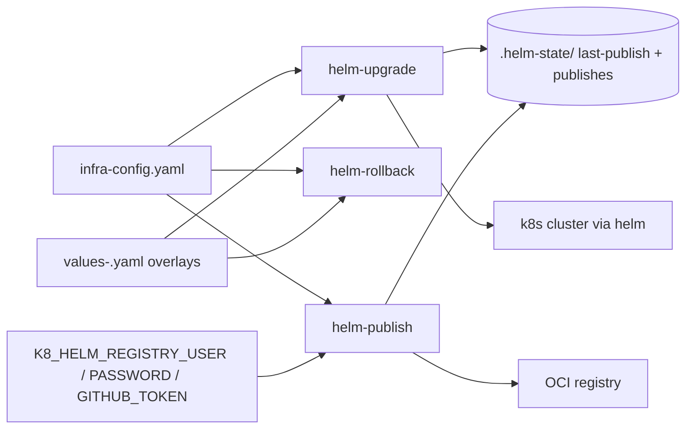

# Project Schema — helm-utils

> **No persistence layer.** This project is a suite of standalone bash CLIs
> (`helm-upgrade`, `helm-rollback`, `helm-publish`). It has **no database, no
> SQL schema, and no Liquibase changelogs**. This doc therefore covers the
> artifacts it *does* define: on-disk state files, the `infra-config.yaml`
> config surfaces it reads, chart values-overlay conventions, and
> environment/secret structure. Repo structure: [PROJ-LAYOUT.md](PROJ-LAYOUT.md).

## 1. Runtime state files

All state lives in `.helm-state/` under the **invoking repo's root**
(`$INFRA_ROOT`), created on demand. Never committed; safe to delete — the
next deploy/publish recreates it. Owned by this repo's scripts
(`helm-upgrade`) and shared k8-lib helpers (`save_helm_publish_state`,
`upgrade-policy.yaml` writer).

| File | Writer | Format | Purpose |
|------|--------|--------|---------|
| `.helm-state/{chart}.md5` | `helm-upgrade` | Single line: rendered-values checksum | Skip unchanged charts on re-upgrade unless `--force` |
| `.helm-state/last-publish` | k8-lib `save_helm_publish_state` | Shell-sourceable `KEY=VALUE` (see below) | Record of most recent publish |
| `.helm-state/publishes` | k8-lib `save_helm_publish_state` | Pipe-delimited lines, newest appended, pruned to last 10 | Short publish history |
| `.helm-state/upgrade-policy.yaml` | k8-lib change-impact engine | YAML | Policy for which detected manifest impacts (restart, configmap, secret, ingress, scaling, service, rbac) require confirmation |

### `.helm-state/last-publish`

```text
LAST_PUBLISH_CHART="<chart-key>"
LAST_PUBLISH_VERSION="<semver>"
LAST_PUBLISH_REGISTRY="<oci://...>"
LAST_PUBLISH_TIME="<unix-epoch-seconds>"
```

### `.helm-state/publishes`

```text
<unix-epoch-seconds>|<chart-key>|<version>|<registry-url>
```

## 2. `infra-config.yaml` surfaces read by these tools

The merged `infra-config.yaml` (repo root of the deployment target) is the
single config source. No config file is owned by this project.

### Upgrade / rollback discovery + ordering

```yaml
paths:
  helm_dir: helm                  # default chart tree scanned recursively
helm_scan_dirs:                   # extra dirs to scan for charts
  - helm/platform
chart_path_overrides:             # alias -> path (path wins over scans)
  <alias>: <path/relative/to/root>
tiers:                            # ordered deployment plan; tier N completes before N+1
  - name: <label>
    tier: <int>
    charts: [<chart-name>, ...]
namespace_overrides: { <chart>: <namespace> }   # beats values.yaml detection
timeout_overrides:   { <chart>: <duration> }    # beats default helm timeout
```

### Publish targets

```yaml
helm:
  oci_registry: oci://<host>/<org>/helm-charts   # default push target
  registry_host: <host>                          # e.g. ghcr.io (auth lookup)

project:
  name: <stack-name>
  type: standalone | composite
  helm:                                          # flat targets (standalone)
    charts:
      - name: <chart>
        path: <path>
        registry: oci://...        # optional per-chart override
  projects:                                      # composite targets
    - domain: <domain-key>
      base_path: <path>
      helm:
        charts: [ { name, path, registry? } ]
paths:
  projects_dir: <dir>              # where composite member projects live
```

Chart key addressing: `<chart>` for flat, `<domain>/<chart>` for composite.

### Chart values overlays (environment deploys)

Convention read by `--env <name>` (helm-upgrade / helm-rollback):

```text
<chart-dir>/values.yaml           # base, always applied
<chart-dir>/values-<env>.yaml     # overlay; presence gates inclusion for that env
```

With `--env <env>`: release name becomes `<env>-<chart>`, only charts owning
`values-<env>.yaml` deploy, and the overlay may set the environment namespace.

## 3. Environment variables / secret structure

No secrets are stored in this repo. Structure only — values come from the
environment or the repo-root `.envrc.k8.dc` (dc/Infisical layering; see
monorepo `docs/secret-management.md`).

| Variable | Used by | Purpose |
|----------|---------|---------|
| `K8_LIB_DIR` | all | Shared shell library location (default `~/.local/share/k8-lib`) |
| `INFRA_ROOT` | all | Root of the deployment target repo (state + config resolution) |
| `K8_HELM_REGISTRY_USER` | helm-publish | OCI registry login |
| `K8_HELM_REGISTRY_PASSWORD` | helm-publish | OCI registry secret (never echoed) |
| `GITHUB_TOKEN` / `gh auth token` | helm-publish | Fallback auth for GHCR pushes |

## 4. Data-flow overview


