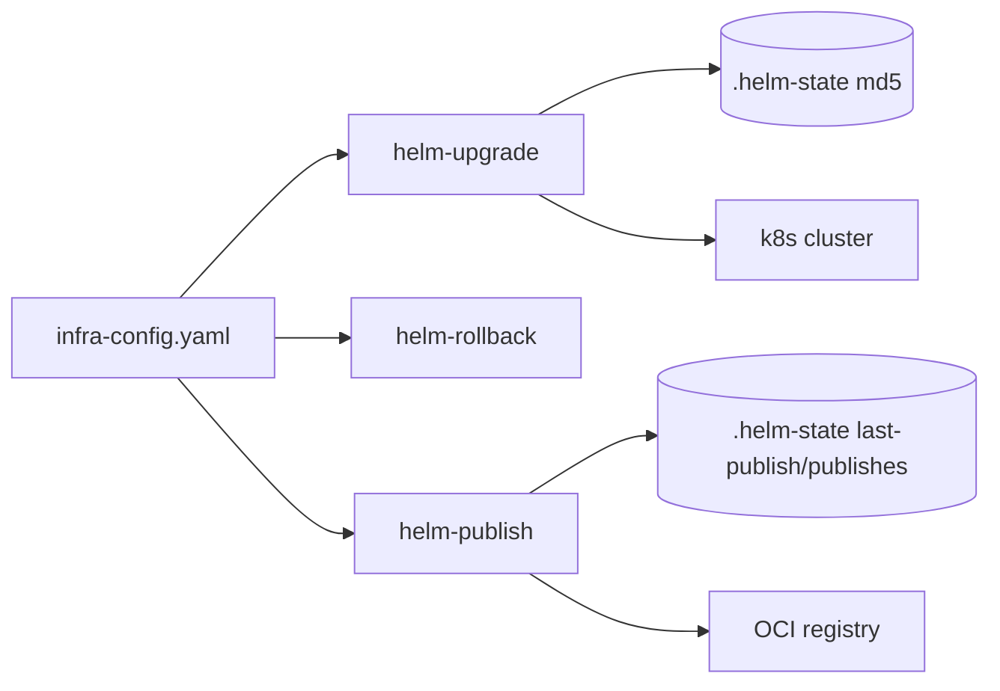

# Project Schema — Summary

**No persistence layer** — bash CLI suite; no DB/SQL/Liquibase. Artifacts documented: on-disk state files, `infra-config.yaml` config surfaces, values overlays, env/secret structure. Full detail: [PROJ-SCHEMA.md](PROJ-SCHEMA.md). Repo structure: [PROJ-LAYOUT.md](PROJ-LAYOUT.md).

## State files (`.helm-state/` in target repo root; untracked, recreatable)

| File | Format | Purpose |
|------|--------|---------|
| `{chart}.md5` | checksum line | Change-detection skip for upgrades |
| `last-publish` | shell `KEY=VALUE` | Last publish record (chart, version, registry, time) |
| `publishes` | `ts\|chart\|ver\|registry` lines, last 10 | Publish history |
| `upgrade-policy.yaml` | YAML | Impact-confirmation policy (restart, configmap, secret, ingress, scaling, service, rbac) |

## `infra-config.yaml` surfaces read

- Discovery: `paths.helm_dir`, `helm_scan_dirs[]`, `chart_path_overrides{alias→path}`
- Ordering: `tiers[]{name, tier, charts[]}`
- Overrides: `namespace_overrides{}`, `timeout_overrides{}`
- Publish: `helm.oci_registry`, `helm.registry_host`; `project.helm.charts[]` (flat) or `project.projects[]{domain, base_path, helm.charts[]}` (composite); keys `<chart>` / `<domain>/<chart>`
- Env overlays: `<chart-dir>/values-<env>.yaml` gates `--env` deploys; release = `<env>-<chart>`

## Env / secrets (structure only; values via env or `.envrc.k8.dc`)

`K8_LIB_DIR`, `INFRA_ROOT`, `K8_HELM_REGISTRY_USER`, `K8_HELM_REGISTRY_PASSWORD`, `GITHUB_TOKEN`/`gh auth token` (GHCR fallback)

